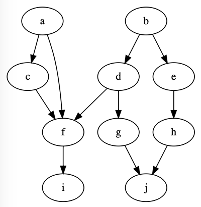

# Batching-Toposort

[](https://www.npmjs.com/package/batching-toposort)
[](https://travis-ci.org/glebec/batching-toposort)
[](https://github.com/prettier/prettier)

Efficiently sort interdependent tasks into a sequence of concurrently-executable batches.

```hs
batchingToposort :: { DependencyId : [DependentId] } -> [[TaskId]]
```

*   `O(t + d)` time complexity (for `t` tasks and `d` dependency relationships)
*   `O(t)` space complexity
*   Zero package dependencies
*   Thoroughly tested (including [invariant tests](http://jsverify.github.io/#property-based-testing))
*   Errors on cyclic graphs

## Motivation

Often one needs to schedule interdependent tasks. In order to determine task order, the classic solution is to use [topological sort](https://en.wikipedia.org/wiki/Topological_sorting). However, toposort typically outputs a list of individual tasks, without grouping those that can be executed concurrently. Batching-Toposort takes this additional consideration into account, producing a list of lists of tasks. The outer list is ordered; each inner list is unordered.

## Usage

```sh
npm install batching-toposort
```



Batching-Toposort expects a [directed acyclic graph](https://en.wikipedia.org/wiki/Directed_acyclic_graph) (DAG) implemented via [adjacency list](https://en.wikipedia.org/wiki/Adjacency_list). In other words, construct an object whose keys are dependency IDs, and whose values are lists of dependent IDs.

```js
const batchingToposort = require('batching-toposort')

// DAG :: { DependencyId : [DependentId] }
const DAG = {
    a: ['c', 'f'], // `a` is a dependency of `c` and `f`
    b: ['d', 'e'],
    c: ['f'],
    d: ['f', 'g'],
    e: ['h'],
    f: ['i'],
    g: ['j'],
    h: ['j'],
    i: [],
    j: [],
}

// batchingToposort :: DAG -> [[TaskId]]
const taskBatches = batchingToposort(DAG)
// [['a', 'b'], ['c', 'd', 'e'], ['f', 'g', 'h'], ['i', 'j']]
```

(If there is demand, Batching-Toposort may one day include a small DAG API and/or [DOT](<https://en.wikipedia.org/wiki/DOT_(graph_description_language)>) support for convenience, but as of now it is the developer's role to construct the graph.)

## Implementation

In short, Batching-Toposort adapts [Kahn's Algorithm](https://en.wikipedia.org/wiki/Topological_sorting#Kahn's_algorithm) by inserting each round of root tasks into sublists rather than appending tasks directly to the main output list.

The classic DAG toposort keeps track of each task's in-degree (number of dependencies). As root tasks (those with no dependencies) are added to the output list, their dependents' in-degree counts are decremented. For a task to become a root, all of its dependencies must have been accounted for. The core algorithm is illustrated below in pseudocode (the actual implementation is in [`src/index.js`](src/index.js)).

```
given G = adjacency list of tasks and dependents (~O(1) lookup):

let N = map from tasks to in-degree counts (~O(1) lookup / update)
let L = [] (empty output list) (~O(1) append)
let R1 = list of root tasks (~O(1) addition, ~O(n) iteration)

while R1 is nonempty
    append R1 to L
    let R2 = [] (empty list for next batch) (~O(1) append)
    for each task T in R1
        for each dependent D of T (as per G)
            decrement in-degree count for D (in N)
            if D's in-degree (as per N) is 0
                add D to R2
    R1 = R2

return L
```

### Performance

The time complexity is `O(|V| + |E|)` for `V` task vertices and `E` dependency edges.

*   The algorithm loops through rounds of roots, and every task is only a root only once, contributing to `O(|V|)` rounds (worst case is a linked list of tasks).
*   Each round handles a disjoint set of dependency edges (those rooted in that round's tasks), so the `O(|E|)` handling of all edges is effectively distributed across rounds.
*   Other operations, e.g. querying a node's in-degree (average case `O(1)`), are carefully managed to preserve the time complexity.

The space complexity is slightly better at `O(|V|)`.

*   The in-degree map size is proportional to the number of vertices `|V|`, but not edges, as those are folded into an integer count during map construction.
*   The output by definition contains `|V|` tasks (distributed among as many or fewer lists).
*   Again, other operations are controlled to keep space complexity low.
